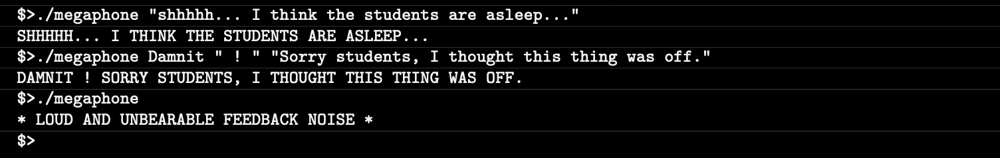
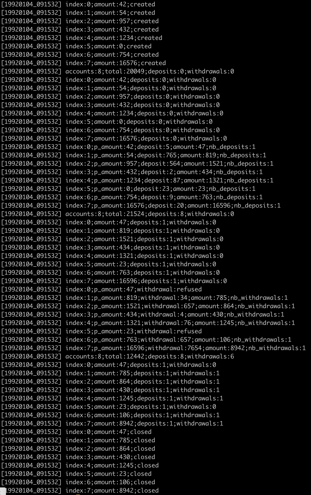

# CPP Module 00

CPP module 00, is a simple group of exercices in c++ to introduce us to the world of c++. In this module we wil learn about namespaces, classes, member functions, stdio streams, initializatin lists, static, const, and more.

## Exercise 00: Megaphone

**Objective**: Make a simple program that outputs the arguments passed but all in uppercase, just like if you where screaming.

**Files**: [`Makefile`](./ex00/Makefile), [`megaphone.cpp`](./ex00/megaphone.cpp)

**Forbbiden funcitons**: None

Example of how it works:

  

## Exercise 01: My Awesome PhoneBook

**Objective**: Write a program that behave like a phonebook.

We have to implement 2 classes:
- **PhoneBook**
  - It has an array of conacts with a maximum of 8 contacts [`Contacts contacts[9]`](./ex01/includes/PhoneBook.hpp).
  - If the user tries to add more than 8 contacts we have to replace the oldest one (1st conact) by the new one.
  - Dynamic allocation is forbidden.
- **Contact**
  - Where all of the information of a contact is saved.
  
When we execute the program the phonebook is empty and the user has to enter one of these three commands (any other input is discarted):
- **ADD**
  - Adds a contact to the phonebook.
  - When entered this command the user will be asked to input some information about the contact field by field. Blank fields are not valid. Once all the fields are completed the contact is added to the phonebook.
  - These fields are: first name, last name, nickname, phone number, and darkest secret.
  
- **SEARCH**
  - Displays the entire phonebook, and then let the user focus on ne single contact by askking the index.
  - Each column has to be 10 characters wide. These columns are: index, first name, last name, nickname.
  - A pipe character ('|') separates them.
  - The text must be right-aligned.
  - If the text is longer than 10 characters it must be truncated and the last dislpable character mus be replaced by a dot.
  - Once displayed all the contacts, the program will ask to the user the index of the contact they want to display. When the user is selected, the program will display all the information line per line.
  
- **EXIT**
  - The program quits and the contacts are lost forever!

**Files**: [`Makefile`](./ex01/Makefile), [`main.cpp`](./ex01/src/main.cpp), [`PhoneBook.cpp`](./ex01/src/PhoneBook.cpp), [`Contact.cpp`](./ex01/src/Contact.cpp), [`PhoneBook.hpp`](./ex01/includes/PhoneBook.hpp), [`Contact.hpp`](./ex01/includes/Contact.hpp)

**Forbbiden funcitons**: None

Example of how it works:

  

## Exercise 02: The Job Of Your Dreams

**Objective**: Given [`Account.hpp`](./ex02/Account.hpp) and [`tests.cpp`](./ex02/tests.cpp) we have to recreate the output saved in [`19920104_091532.log`](./ex02/19920104_091532.log) except for the timestamps.

**Files**: [`Makefile`](./ex02/Makefile), [`Account.cpp`](./ex02/Account.cpp), [`Account.hpp`](./ex02/Account.hpp), [`tests.cpp`](./ex02/tests.cpp)

**Forbbiden funcitons**: None

Comparison between my output (left) and the output saved in the [`19920104_091532.log`](./ex02/19920104_091532.log) file (rigth):

  
  

